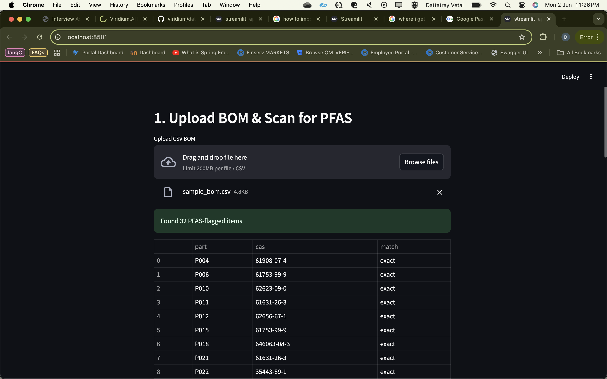
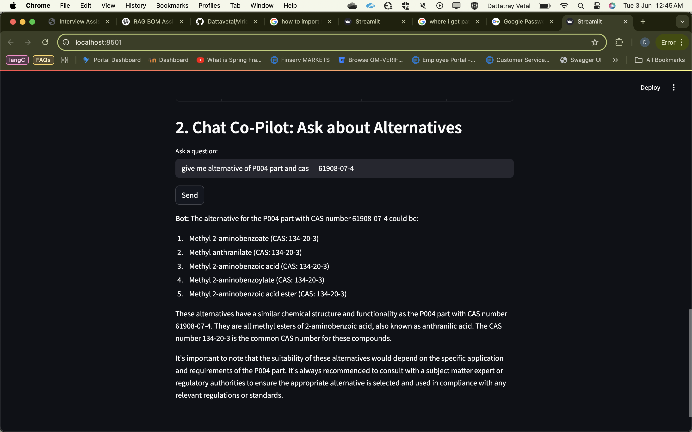

Here's your corrected and properly formatted `README.md` in full **Markdown syntax**:

---

```markdown
# 🔬 PFAS Detection & Alternative Recommendation Assistant

This AI-powered assistant is designed to help manufacturers, engineers, and compliance teams identify and eliminate hazardous chemicals—especially PFAS (Per- and Polyfluoroalkyl Substances)—from their product Bill of Materials (BOM).
By combining semantic search (FAISS), regulatory datasets (EPA PFASSTRUCT & ZeroPM), and LLM-based reasoning (Claude via AWS Bedrock), this system provides:

✅ Automatic detection of PFAS substances in uploaded BOM files, using both CAS number and semantic description matching

✅ AI-driven chat assistant to answer natural language questions about materials, risks, and regulatory implications

✅ Alternative recommendations for high-risk substances, ranked by similarity, use-case, and relevance

✅ Streaming text + audio output (optional with Streamlit UI) to simulate a voice-driven materials advisor
---

```
## 🖥️ UI Preview

Here’s a screenshot of the Streamlit-based UI in action:



```

## 🧠 Features

- **Upload BOMs (CSV)** and detect PFAS chemicals by CAS number or semantic match
- **Chat Co-Pilot** answers material-related questions with context-aware LLMs (Claude via AWS Bedrock)
- **Suggest Alternatives** using a FAISS index built from ZeroPM data
- **Supports semantic and exact matching**
- Fully built with: `Flask`, `FAISS`, `Claude`, `SQLite`, and `Streamlit`

---

````
```text
## 📦 Project Structure
.
├── data/
│   ├── pfas\_master\_list.csv
│   ├── ZeroPM\_Alternative\_Assessment\_DB\_v2.0.xlsx
│   └── sample_bom
├── data\_ingest.py
├── backend.py
├── streamlit\_app.py
├── vector\_store.py
├── aws\_bedrock.py
├── pfas\_names.faiss
├── pfas\_names.json
├── alternatives.faiss
├── alternatives.json
├── pfas\_lens.db
├── requirements.txt
└── README.md

````

---

## 🚀 Quickstart

### 1. Install Dependencies

```bash
pip install -r requirements.txt
````

### 2. Run the Ingest Script

```bash
python data_ingest.py
```

This will:

* Load PFAS data into SQLite
* Build FAISS vector indexes for PFAS and safer alternatives

### 3. Start the Backend

```bash
python backend.py
```

### 4. Start the Streamlit UI

```bash
streamlit run streamlit_app.py
```
### 5. Create .env File for AWS Bedrock Access
Create a file named .env in the root of the project with the following content:

```bash
AWS_REGION=your-aws-region
AWS_ACCESS_KEY_ID=your-access-key-id
AWS_SECRET_ACCESS_KEY=your-secret-access-key
BEDROCK_MODEL_ID=anthropic.claude-3-haiku-20240307

```
🔐 Note: Never commit your .env file to GitHub. It contains sensitive credentials used to connect to AWS Bedrock and the Claude model.

---

## 🔍 Sample Query Flow

1. Upload a BOM CSV with part numbers and CAS fields
2. The app will flag PFAS entries
3. Ask in chat:
   *“Suggest alternatives for CAS 61908-07-4”*
4. You'll receive top-ranked ZeroPM-safe substitutes with use-case info

---

## 🧱 Technologies Used

* **AWS Bedrock (Claude)** for LLM-based responses
* **FAISS** for fast, similarity-based material matching
* **SentenceTransformers (MiniLM-L6-v2)** for embedding text
* **SQLite** for local CAS-to-name lookup
* **Streamlit** for the UI
* **Flask** for API backend

---

## 📄 License

MIT License — for educational and demonstration purposes only.

